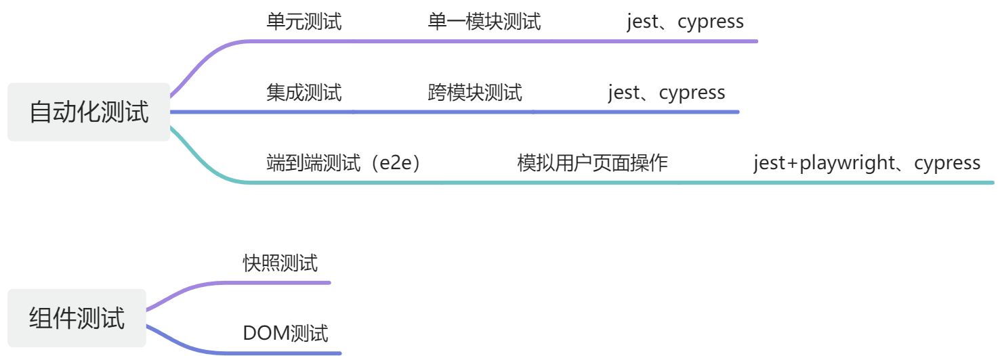
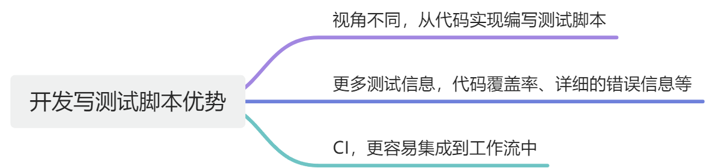
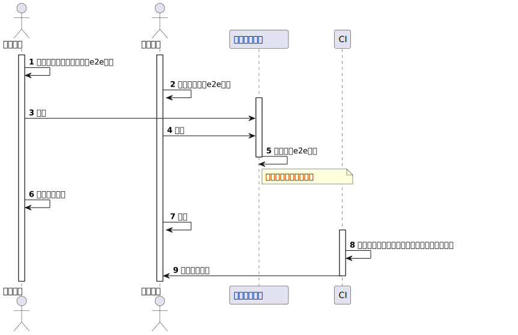
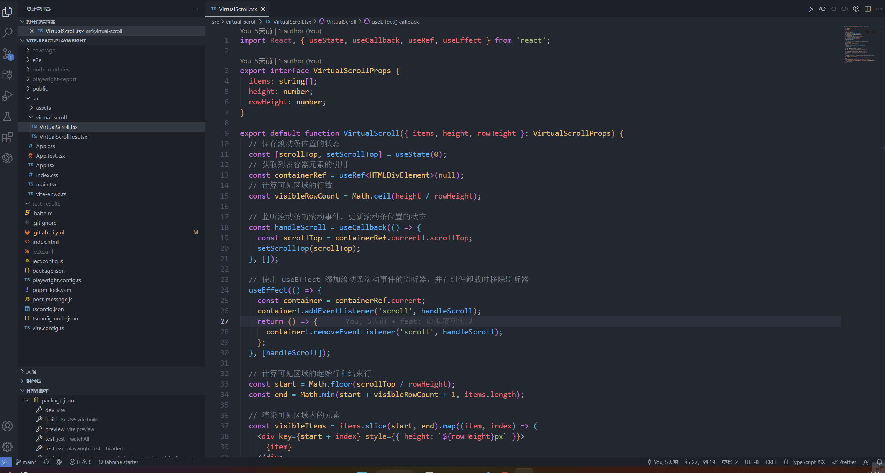

# 前端自动化测试

## 现状





## 技术选型

技术选择：jest+@testing-library/react+playwright

```bash
yarn add -D jest @playwright/test babel-jest jest-environment-jsdom react-test-renderer @testing-library/react @types/jest
```

cypress 使用中的问题

- 不支持 Taro 项目，官方只支持 Jest（[https://taro-docs.jd.com/docs/external-libraries#jest](https://taro-docs.jd.com/docs/external-libraries#jest)）
- 硬件要求高，官网最低要求 4GB+2CPU

## 流程与规范



### 目录与命名规范

- 单元测试一般放在对应目录的 `__tests__`文件夹下，命名为测试代码的文件名中加 `.test`
- e2e 测试放在根目录 e2e 下，命名 xxxx.test.ts

## 组件测试

```typescript
import { render } from '@testing-library/react';
import IncPrice from '.';

jest.mock('antd-mobile/es/utils/native-props', () => {
  return {
    withNativeProps: (props, el) => el,
  };
});

describe('价格组件', () => {
  it('1+100=>1积分+1.00元', () => {
    const { container } = render(<IncPrice integral={1} currency={100} />);
    expect(container.textContent).toBe('1积分+1.00元');
  });
  it('0+100=>1.00元', () => {
    const { container } = render(<IncPrice integral={0} currency={100} />);
    expect(container.textContent).toBe('1.00元');
  });
  it('1=>1积分', () => {
    const { container } = render(<IncPrice integral={1} currency={0} />);
    expect(container.textContent).toBe('1积分');
  });
  it('0+0=>免费', () => {
    const { container } = render(<IncPrice integral={0} currency={0} />);
    expect(container.textContent).toBe('免费');
  });
});
```

> 可以使用 chatGPT 生成基础测试代码



## e2e 测试

```typescript
import { test } from '@playwright/test';

test.beforeEach(async ({ page }) => {
  await page.goto('https://127.0.0.1:10086');
});

test.describe('下单', () => {
  test('券码下单流程', async ({ page }) => {
    const goodsName = '券码';
    await page.getByPlaceholder('请输入关键词').fill(goodsName);
    await page.keyboard.press('Enter');
    await page.getByText(goodsName).last().click();
    // 商品详情页
    await page.getByRole('button', { name: '立即兑换' }).click();
    // 确认订单页
    await page.getByRole('button', { name: '提交订单' }).click();
    // 支付结果页
    await page.waitForSelector('text=支付成功');
  });
});
```

## GitLab 工作流集成

```yml .gitlab-ci.yml
stages:
  - test
  - deploy

.testTpl:
  rules:
    # 提交默认分支时触发
    - if: $CI_COMMIT_BRANCH == $CI_DEFAULT_BRANCH
      when: always

test:
  extends: .testTpl
  image: mcr.microsoft.com/playwright:v1.31.0-focal
  stage: test
  script:
    - 'yarn'
    # jest --ci --coverage --runInBand --reporters=default --reporters=jest-junit
    - 'yarn test:ci'
    # playwright test ; node ./post-message.js  用于发消息到企微
    - 'yarn test:e2e:ci'
  artifacts:
    reports:
      cobertura: coverage/cobertura-coverage.xml
      junit:
        # 单测报告
        - junit.xml
        # e2e报告
        - je2e.xml
    paths:
      - coverage
      - playwright-report
      - test

pages:
  extends: .testTpl
  stage: deploy
  dependencies:
    - test
  script:
    # 部署单测报告到 GitLab Pages
    - mv coverage/ public/
  artifacts:
    paths:
      - public
```

post-message.js 部分代码

```js
async function main() {
  // 读取e2e报告文件
  if (fs.existsSync('je2e.xml')) {
    const xml = fs.readFileSync('je2e.xml', 'utf8').toString();
    const result = await parser.parseStringPromise(xml);
    const { testsuites } = result;
    const { time, tests, failures } = testsuites.$;
    // 拼接消息并发送到企微
    const msg = `总数: ${tests}  失败: ${failures}  耗时: ${Math.floor(time)}s\n\n
   ${testsuites.testsuite
     .map(
       (m) => `${m.$.name}\n
       ${m.testcase
         .map(
           (c) =>
             `>${c.failure ? '<font color="warning">✕</font>' : '<font color="info">✓</font>'} ${
               c.$.name
             } (${c.$.time * 1000} ms)`,
         )
         .join('\n')}`,
     )
     .join('\n')}\n\n流水线地址：${process.env.CI_PIPELINE_URL}`;

    postMsgToQw(msg);
  }
}
```

> 完整例子：<https://github.com/dobble11/daydayup-playground/tree/main/vite-react-playwright>
