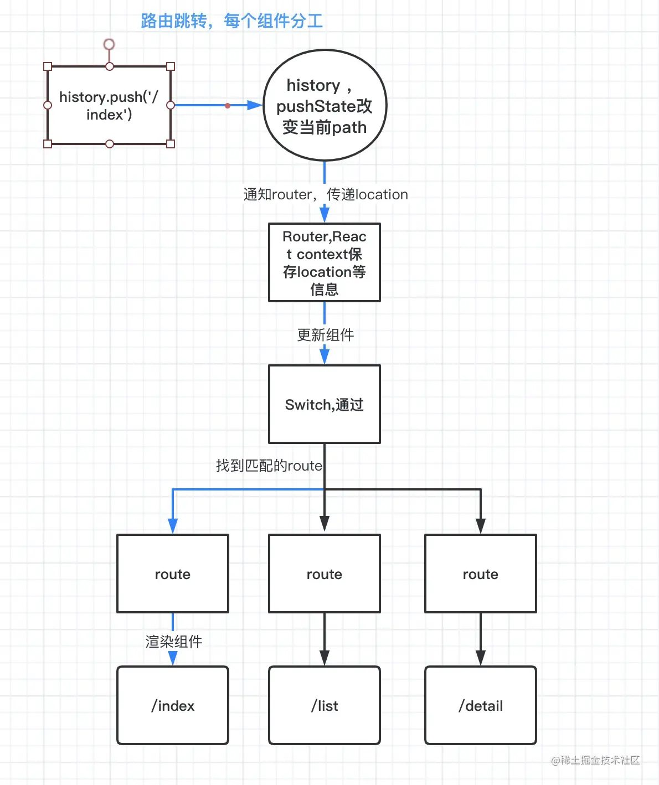

# react-router 实现

## history

- pushState 与 replaceState 改变路由，不会触发路由事件
- 监听路由改变事件（只在浏览器行为下触发，前进后退、history 方法 forward、back、go）

  window.addEventListener('popstate',function(e){ // 监听改变 })

  需要修改 nginx 支持路由重定向到 index.html

```nginx
 location / {
   try_files $uri $uri/ /index.html;
 }
```

## hash

- location.hash 设置改变路由
- onhashchange 监听路由改变

  window.addEventListener('onhashchange',function(e){ // 监听改变 })

```js
function push(path) {
  location.hash = path;
}
function replace(path) {
  const hashIndex = location.href.indexOf('#');
  const href = hashIndex === -1 ? url : url.slice(0, hashIndex);

  location.replace(href + '#' + path);
}
```

## 总结

v5 版本：路由改变 history 创建新的 location 对象，Router 监听 history 触发的事件，并更新 RouterContext 的 location 值，触发 Switch 匹配 Route 并渲染



图片来源：<https://juejin.cn/post/6886290490640039943>
