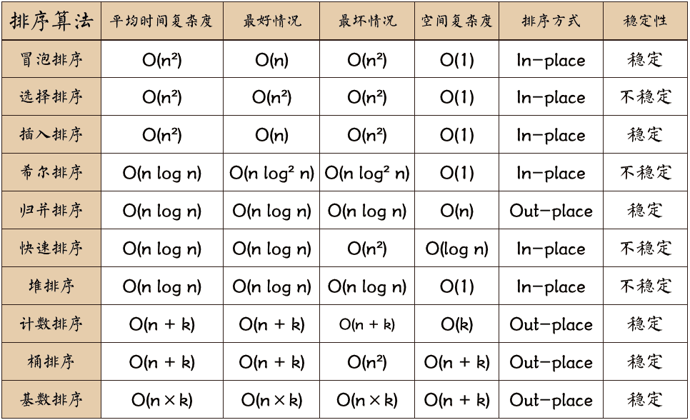

# 排序算法



## 冒泡排序

```javascript
function bubbleSort(nums) {
  var n = nums.length;
  var temp, didSwap;

  for (var i = 0; i < n - 1; i++) {
    didSwap = false;
    for (var j = 0; j < n - i - 1; j++) {
      if (nums[j] > nums[j + 1]) {
        temp = nums[j];
        nums[j] = nums[j + 1];
        nums[j + 1] = temp;
        didSwap = true;
      }
    }

    // 正序情况下直接返回
    if (!didSwap) {
      return;
    }
  }
}
```

## 归并排序

```javascript
class Merge {
  static temp;

  static sort(nums) {
    Merge.temp = [];
    Merge._sort(nums, 0, nums.length - 1);
  }

  static _sort(nums, lo, hi) {
    if (lo === hi) {
      return;
    }
    var mid = lo + Math.floor((hi - lo) / 2);
    Merge._sort(nums, lo, mid);
    Merge._sort(nums, mid + 1, hi);
    Merge.merge(nums, lo, mid, hi);
  }

  static merge(nums, lo, mid, hi) {
    for (var i = lo; i <= hi; i++) {
      Merge.temp[i] = nums[i];
    }
    // 合并两个升序数组 temp[lo,mid] temp[mid+1,hi]
    var i = lo,
      j = mid + 1;
    for (var p = lo; p <= hi; p++) {
      if (i === mid + 1) {
        // 左半边数组被全部合并
        nums[p] = Merge.temp[j++];
      } else if (j === hi + 1) {
        // 右半边数组被全部合并
        nums[p] = Merge.temp[i++];
      } else if (Merge.temp[i] > Merge.temp[j]) {
        nums[p] = Merge.temp[j++];
      } else {
        nums[p] = Merge.temp[i++];
      }
    }
  }
}

Merge.sort([5, 2, 3, 1]);
```

## 快速排序

```javascript
class Quick {
  static sort(nums) {
    // 洗牌降低退化成一个链表的概率
    Quick.shuffle(nums);
    Quick._sort(nums, 0, nums.length - 1);
  }

  static _sort(nums, lo, hi) {
    if (lo >= hi) {
      return;
    }
    // 对 nums[lo..hi] 进行切分
    // 使得 nums[lo..p-1] <= nums[p] < nums[p+1..hi]
    var p = Quick.partition(nums, lo, hi);

    Quick._sort(nums, lo, p - 1);
    Quick._sort(nums, p + 1, hi);
  }

  // 对 nums[lo..hi] 进行切分
  static partition(nums, lo, hi) {
    // [lo, i) <= pivot && (j, hi] > pivot
    var pivot = nums[lo];
    var i = lo + 1,
      j = hi;

    while (i <= j) {
      while (i < hi && nums[i] <= pivot) i++;
      while (j > lo && nums[j] > pivot) j--;

      // 此时 [lo, i) <= pivot && (j, hi] > pivot
      if (i >= j) {
        break;
      }
      [nums[i], nums[j]] = [nums[j], nums[i]];
    }
    [nums[lo], nums[j]] = [nums[j], nums[lo]];
    return j;
  }

  // 洗牌算法，将输入的数组随机打乱
  static shuffle(nums) {
    var n = nums.length;
    for (var i = 0; i < n; i++) {
      // 生成 [i, n - 1] 的随机数
      var r = i + Math.floor(Math.random() * (n - i));
      [nums[i], nums[r]] = [nums[r], nums[i]];
    }
  }
}
```

## 堆排序

```javascript
function heapSort(nums) {
  buildMaxHeap(nums);
  for (var i = nums.length - 1; i >= 0; i--) {
    // 交换堆顶与最后一个元素
    [nums[i], nums[0]] = [nums[0], nums[i]];
    // 下沉堆顶元素到合适位置
    maxHeapify(nums, 0, i);
  }
}

function buildMaxHeap(nums) {
  var n = nums.length;
  // 从低向上构建大堆
  for (var i = Math.floor(n / 2) - 1; i >= 0; i--) {
    maxHeapify(nums, i, n);
  }
}

/**
 *
 * @param {*} nums
 * @param {*} i 父节点下标
 * @param {*} len 堆大小
 */
function maxHeapify(nums, i, len) {
  var largest = i;
  var left = i * 2 + 1;
  var right = i * 2 + 2;

  if (left < len && nums[left] > nums[largest]) {
    largest = left;
  }
  if (right < len && nums[right] > nums[largest]) {
    largest = right;
  }

  if (largest !== i) {
    // 上浮大元素
    [nums[i], nums[largest]] = [nums[largest], nums[i]];
    // 下沉小元素
    maxHeapify(nums, largest, len);
  }
}
```
